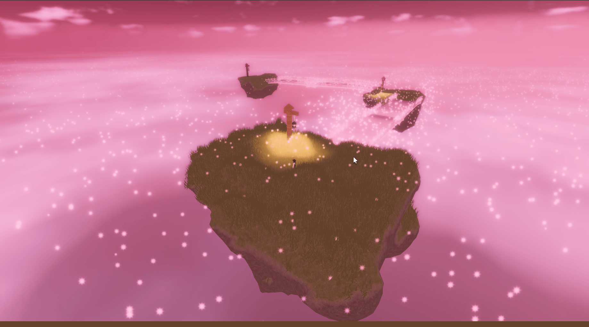
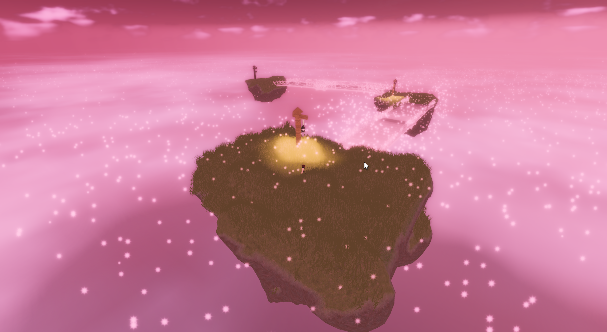
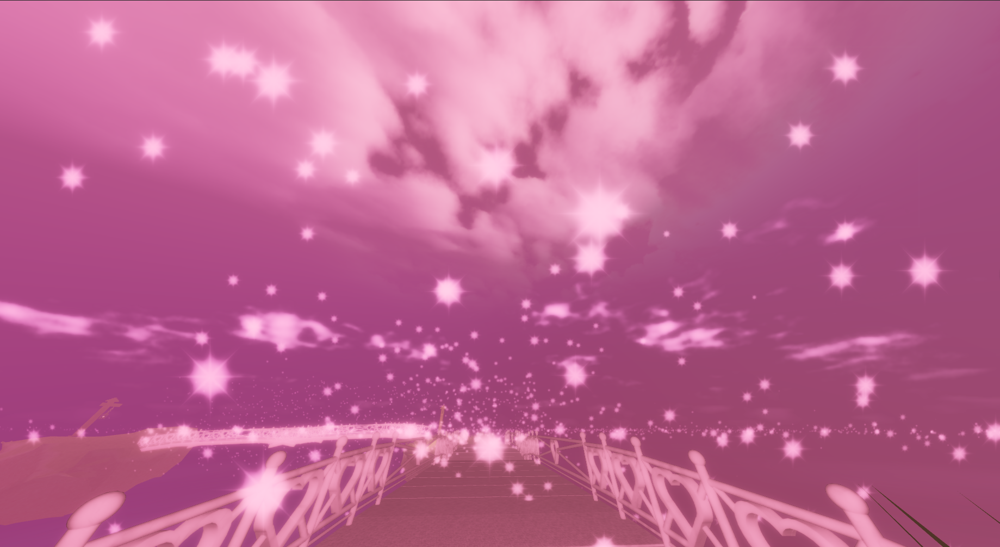
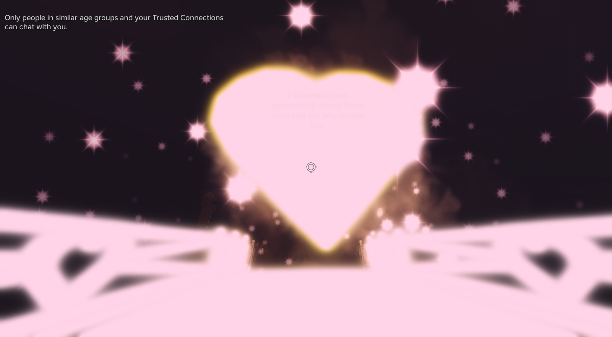
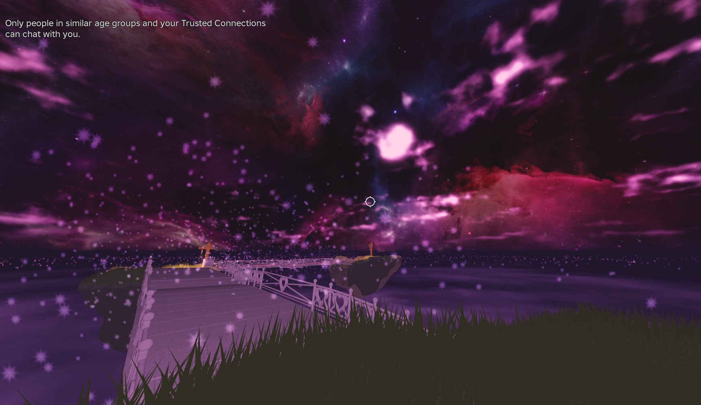

# 🌌 Hello Valentine — Cinematic Roblox Experience

Cinematic camera, lighting, and player-control framework for immersive storytelling in Roblox.



[](https://www.roblox.com/games/90378282464127/Hello-Valentine)

A narrative-driven Roblox experience focused on **atmosphere, emotion, and cinematic control systems** rather than traditional gameplay mechanics.

Instead of score, combat, or progression systems — this project explores how **lighting, camera movement, player control, and environment transitions** can be used to create a feeling-based interactive experience.

> The player is not playing a game — the player is inside a moment.

---

## 🎯 Project Goal

To study:

**How far storytelling can go inside Roblox using only systems — without dialogue trees, quests, or UI-heavy design.**

The experience guides the player through a sequence of memories using:

* Environmental transitions
* Controlled camera behavior
* Lighting psychology
* Movement restriction
* Timed pacing

---

🌍 World Atmosphere



The world establishes emotional context before mechanics.
Environment acts as narrative language rather than decoration.

---

## 🧠 What This Demonstrates

This project is intentionally not an obby or simulator.

It demonstrates **game engine understanding and system design**:

* Client ↔ Server architecture
* Event-driven design
* Cinematic camera scripting
* First-person immersion techniques
* Player state control
* Modular cutscene framework
* Lighting as gameplay language
* Emotional pacing through timing

---

## 🏗 Core Systems Implemented

---

### 1. Trigger-Driven Narrative System

Invisible zones control story progression.

```
Player enters region → event fires → world changes → next moment begins
```

Used to control pacing and player attention.

---

### 2. Server → Client Cutscene Architecture

The server detects interaction, but **only the interacting player experiences the cinematic**.

**Server responsibilities**

* Detect touch
* Freeze character
* Fire RemoteEvent

**Client responsibilities**

* Take camera control
* Play cutscene
* Restore control

Prevents global disruption in multiplayer.

---

### 3. Cinematic Camera System



Custom scriptable camera built using `CFrame` math.

Features:

* Look-around sequence
* Directional focus
* Smooth easing
* FOV breathing
* Timed rotations

Technologies used:

* `TweenService`
* `RunService.RenderStepped`
* Yaw & Pitch manipulation

---

### 4. First-Person Immersion Technique

Character body hidden locally:

```
LocalTransparencyModifier
```

Creates a true first-person emotional perspective instead of Roblox default zoom camera.

---

### 5. Player Control Override

During cinematic moments:

* Walk disabled
* Jump disabled
* Rotation locked
* Velocity cleared
* Inputs blocked (ContextActionService)

Then safely restored.

---

### 6. Dynamic Lighting Transition System

The world changes emotional tone using fog, bloom, and color shifts.

 

Environment reacts to progression:

| Stage  | Effect                |
| ------ | --------------------- |
| Start  | Warm & safe           |
| Bridge | Darkness & fog        |
| Memory | Focus lighting        |
| Final  | Bright transformation |

Lighting communicates emotional state instead of UI text.

---

### 7. Memory Sequence System

Memory spheres appear sequentially:

1. Player approaches
2. Object activates
3. Text displays
4. Next memory unlocks

Uses timed waits for emotional pacing instead of instant feedback.

---

### 8. Atmospheric Effects

Implemented using:

* ParticleEmitters
* Bloom
* PointLight control
* Fog walls
* Sky transitions

Purpose: guide attention without arrows or markers.

---

## 🧩 Modular Cutscene Framework

The project is structured so new cinematic moments can be added easily.

Example usage pattern:

```
Cutscene.PlayLookAround()
Cutscene.FocusObject(object)
Cutscene.LockPlayer()
Cutscene.ReleasePlayer()
```

No duplicated scripts required.

---

## 🛠 Technologies Used

* Roblox Studio
* Luau
* TweenService
* RunService
* RemoteEvents
* ContextActionService
* CFrame Mathematics
* Lighting & Post-Processing
* BillboardGui
* Particle Systems

---

## 📚 Concepts Learned

### Programming

* Event-driven scripting
* State management
* Modular architecture
* Timing & sequencing
* Debugging asynchronous systems

### Engine Knowledge

* Player vs Character distinction
* Client-only camera control
* Local vs Server execution
* Frame-based animation
* Object instancing

### Math & Graphics

* Vector3 distance
* CFrame rotation
* Interpolation
* Frame timing (delta time)

---

## 🧪 Major Problems Solved

### Camera not affecting player

**Cause:** Camera control must be client-side
**Fix:** Move to LocalScript + RemoteEvent

---

### Light values resetting

**Cause:** Multiple tweens overriding each other
**Fix:** Wait for tween completion before loop

---

### Invisible wall not fading

**Cause:** Started already transparent
**Fix:** Spawn visible → then fade

---

### Memory sequence skipping

**Cause:** Next trigger enabled too early
**Fix:** Sequenced activation with delay

---

## 🗺 Experience Flow

```
Safe Island
    ↓
Bridge Trigger
    ↓
Camera Control
    ↓
Darkness Transition
    ↓
Memory Encounters
    ↓
Final Portal
```

---

## 📁 Project Structure

```
Workspace
 ├── Islands
 ├── Bridges
 ├── MemoryObjects
 ├── Portal
 └── LightingControllers

ReplicatedStorage
 └── RemoteEvents

StarterPlayerScripts
 └── CutsceneClient

ServerScriptService
 └── TriggerHandler
```

---

## 🚀 Future Improvements

* Multiple endings
* Multiplayer synchronized moments
* Sound-driven cues
* Adaptive camera behavior
* Saveable memory states

---

## 👤 Author

**Arindam Bhattacharjee**
Roblox systems & cinematic gameplay experimentation

---

## 💭 Closing Note

This project is an experiment in **interactive feeling design**.

Instead of rewarding the player for winning,
it tries to make the player *feel something while moving forward*.

Testing git workflow
Working from a branch now
bridge lighitng test change

editting
practce-2

practice-3
